##### Filip Stefaniuk fs361039
# Assignment 3

### Introduction
The task of computing statistics of proper parentheses expressions seemd easy at first but it turned out to be suprisingly difficult. I have tested multiple architectures, and even though the predictions for the short expressions are mostly correct none of them generalize well for long sequences.

### Data Generator
I have decided to use generator as my dataset. The reason is flexibility. I wanted to test how models learn on various sequence lenghts and this approach allowed me to easily change number of brackets. 

I am aware of concerns raised by this approach, namely that during training model is able to learn on all the inputs from test set since for testing I am using the same data generator. Model could potentially learn all the statistics for the given sequences "by heart" instead of learning how to compute them. Even though it is possible for the short sequences I believe that when sampling uniformly from the distribution of possible sequences of longer lenght there is simply too many possibilities for that to happen (since the number of possible bracketings grows exponentially).

One strong assumption for the above statement is that I need to sample uniformly form the dataset. This happens to be extremely difficult task. Since proper parentheses can be naturally represented as tree the problem of choosing random sequence of n bracketings can be expressed as choosing random unlabeled tree with n nodes. I have found algorithms to uniformly generate random labeled trees of but to my knowledge there is no algorithm to generate uniformly unlabeled trees other than choosing from all possible (previously generated) possibilities. Obviously this approach is not fit for my problem since I want to generate long sequences, and I can't afford storing all the trees of that length.

I have decided to write simple generator, which for each node randomly chooses one of the previously generated nodes as it's parent. Obviously in that case more "branched" trees will be chosen more oftem. To fix that I have written second generator with a heuristic that promotes trees that are "less branched". I empiricly tested and chose the parameters so that the merge of those generators choses choses samples as "uniformly" as possible.

Below results of generating 106 samples of length 5 and 10 (The samples are not in any particular order):

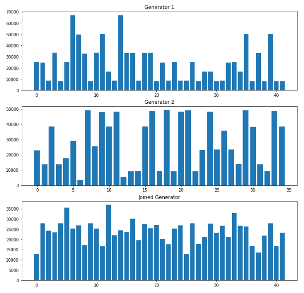 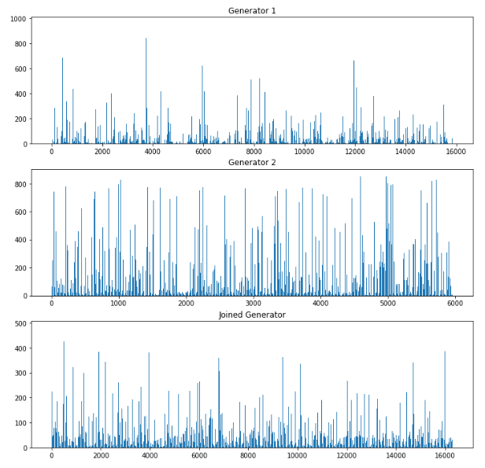

### Network Architecture
For writing neural network I used Tensorflow. I used dynamic rnn which allows to process inputs of various lenghts.

My model takes as input array of strings (bracket expressions) and previously computed statistics. It converts string to one-hot encodding and padd sequences with 0 to the length of the longest sequence in batch. The input is then passed through parametrizable number of recurrent layers and finaly last output goes through fully conneced layer. This sollution allows to have various lenghts of brackets even across one batch.

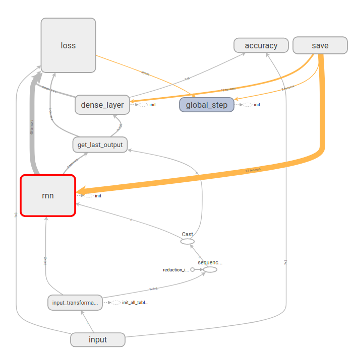

I would like to point out that choosing on learning only on the last output form the recurrent layer was very concious decision. Since there was no clear answer if we should train on statistics from the whole sequence or sequences of partial statistics I decided to go with the first option. The argumentation behind that choise is that in real case scenario there is no algorithm to compute partial statistics (since then we wouldn't have to use neural networks), and I consider providing steps of this algorithm as cheating. I am aware that it makes learning much more difficult as I will show but It is possible to achieve similar effect by showing large number of examples of different length.

### Loss & Metrics
I have decided to use loss function that seems natural in that case that is mean squared error. For prediction of correct values I am rounding up the result up to the nearest integer. This allows me to compute accuracy, which I am computing per statistic to check which one of them is the most difficult to learn. 

For optimization I am using RMSProp which I empirically found gave the best results.

### Experiments
I decided to train relatively small networks not to overfit the data. RNNs don't paralelize well so to utilize potential of arnold I trained network of batches of size 256. All sequences in batch had random sizes so i believe it worked similar to feeding the sequence as output, but without explicitly providing algorithm steps as I mentioned before. I decided to train on sizes up to 50 (number of bracket pairs).

The networks I have testet had only one layer of 64 neurons. I wanted to focus on testing the performance of diffrent cell types. Finally I have tested 3 models with cells BasicRNN, LSTM and GRU.

The learning was extremely slow (mostly due to large bach sizes) but steady in case of LSTM (orange) and GRU (pink) which performed much better than RNN (red). It is worth mentioning that even though GRU performed slightly worse the time of learning was much faster than LSTM. wich is the reason why it is widely used by many researchers.

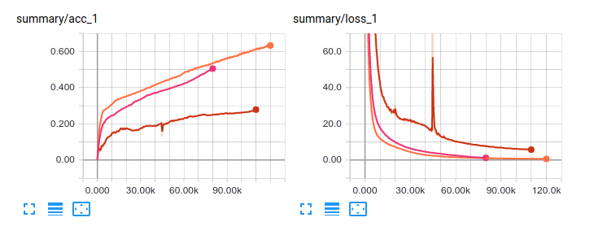

when looking at accuracy per the "largest distance between brackets" is clearly the most difficult statistic to learn:

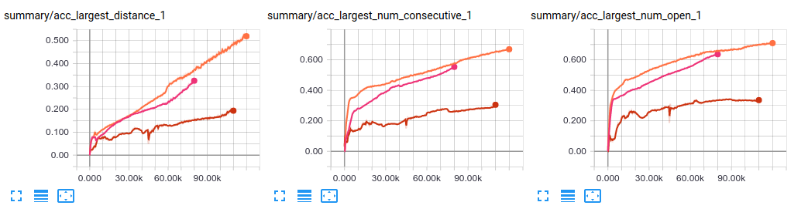

#### Quality of learned statistics
I measured loss and accuracy both average and for each statistic. 
##### Based on length
To check the quality of learned statistics based on input length, I am randomly generating samples of 1000 of length from 1 to 100. Here are the results:

###### RNN
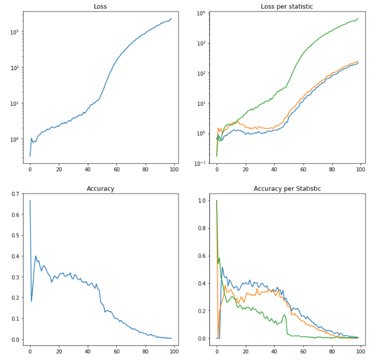
###### GRU
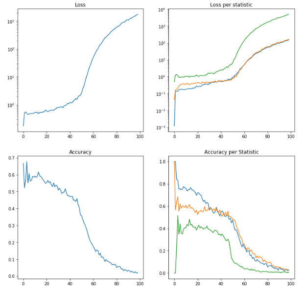
###### LSTM
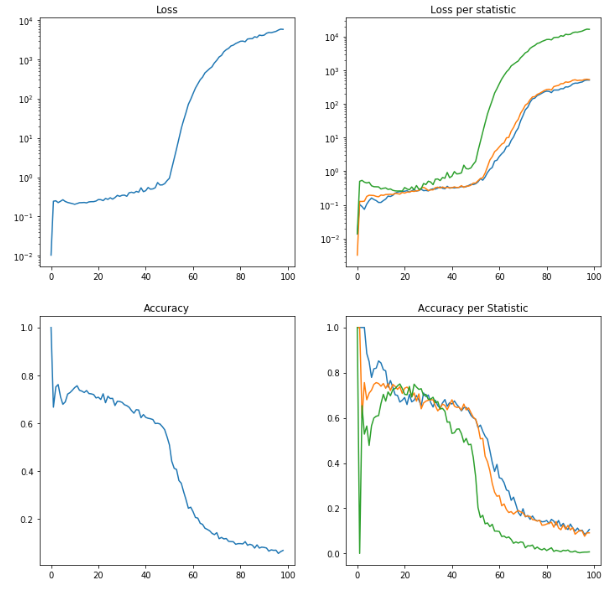

It seems that the networks struggled with learning the third statistic(green) even for short inputs. Again LSTM and GRU performed significantly better than RNN.

### Based on value
To check the quality of learned statistics based on value I generate 32000 samples and predictions and group them by value. 
###### RNN
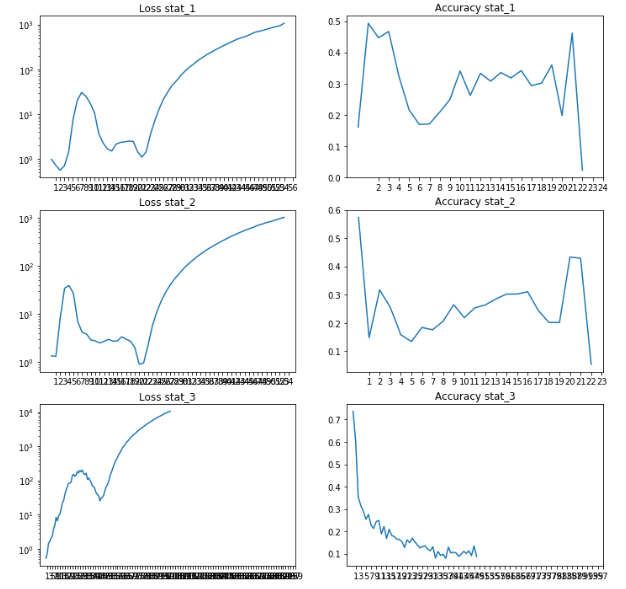
###### GRU
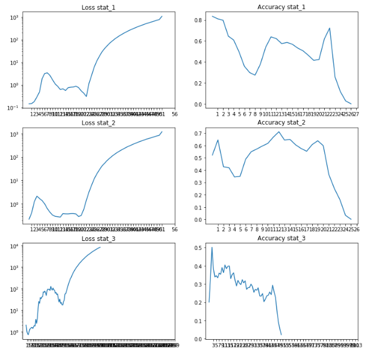
###### LSTM
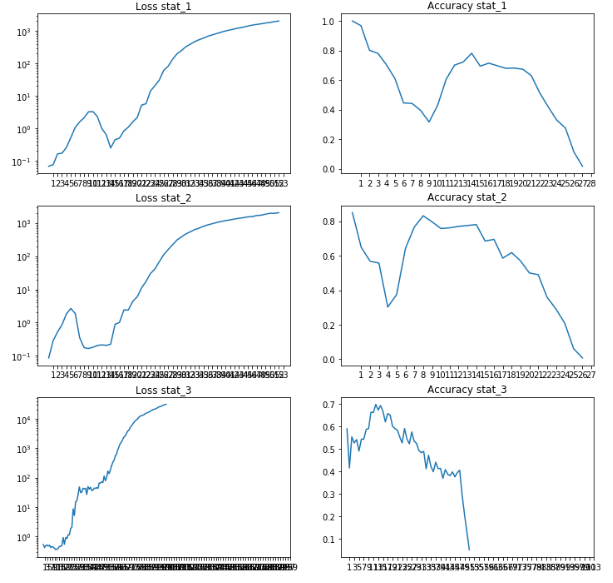

When analysing metrics based on value it is hard to miss the interesting peak in accuracy near the values 10-15. I believe it is due to the fact that simply those numbers of statistics are the most common for my generator. The other reason may be that in long sequences small values of statistic can be easly changed.

### Other Experiments
I haven't managed to test and document all my ideas for solving this problem so I will just describe them shortly.

##### Deeper network
I have performed some experiments with deeper networks (2 layers) but the results weren't better. Moreover with recurrent networks it is really slow and difficult to train deep networks.

##### Larger network
Larger network performed better on short lengths but the accuracy was dropping dirastically after maximum number of brackets showed on training. As showed below network overfit pretty badly:
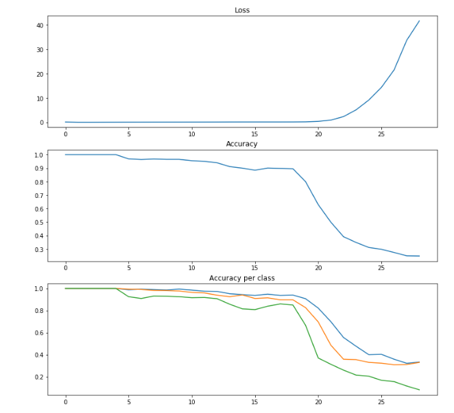

##### Convolutional Network
I haven't managed to test this idea but I believe 1D convolutions could perform well for this type of problem.

### Conclusion
The results are suprisingly bad for such simple problem. The networks overfit for small inputs or perform really bad in general. The loss  cumulates with length that causes the accuracy to drop pretty fast. LSTM performs best of all three types of rnns but learns much slower. The first and second statistic were trainable but the third was difficult even for small inputs.